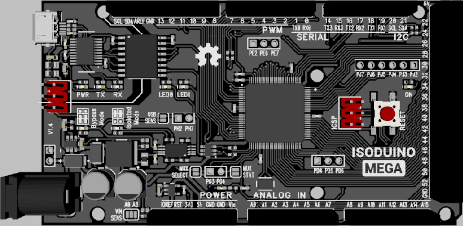
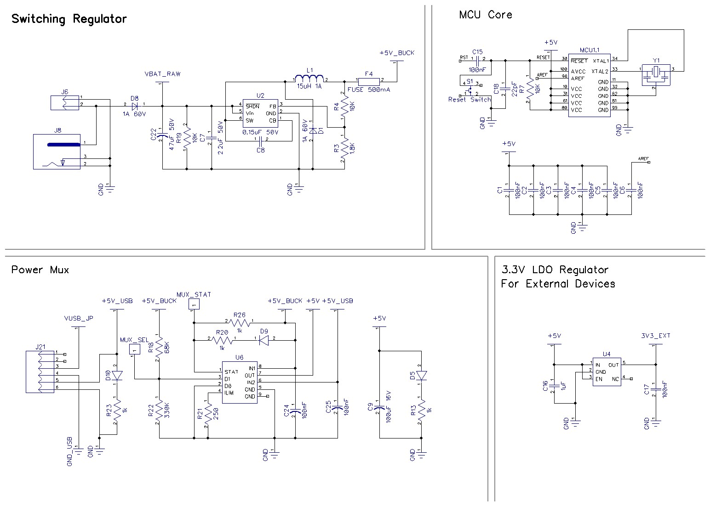
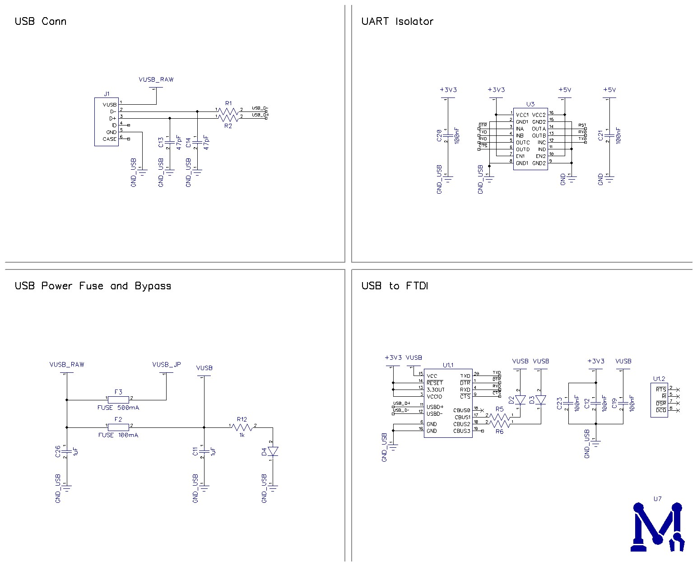
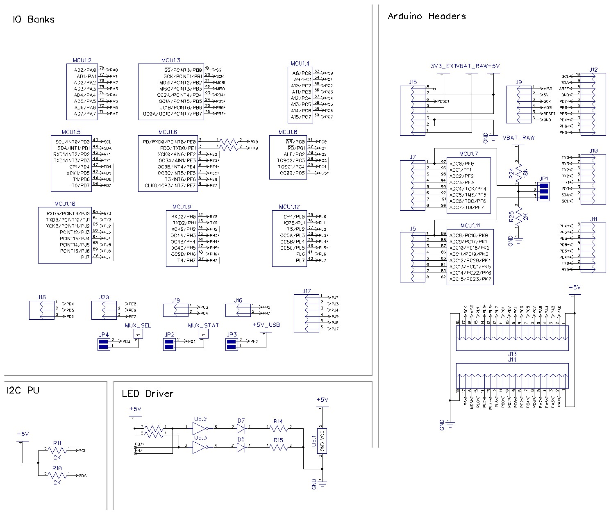
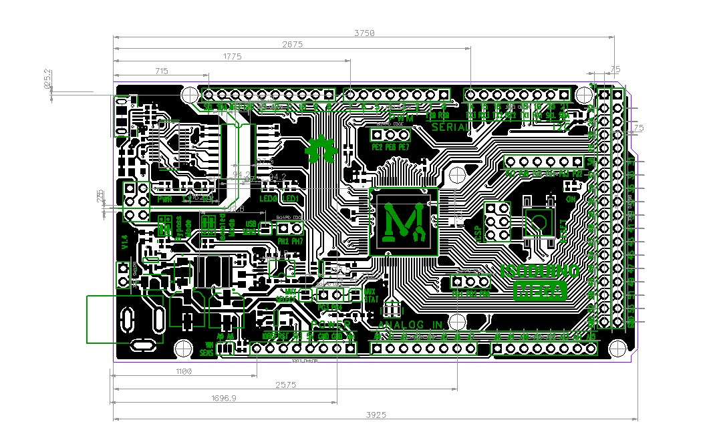
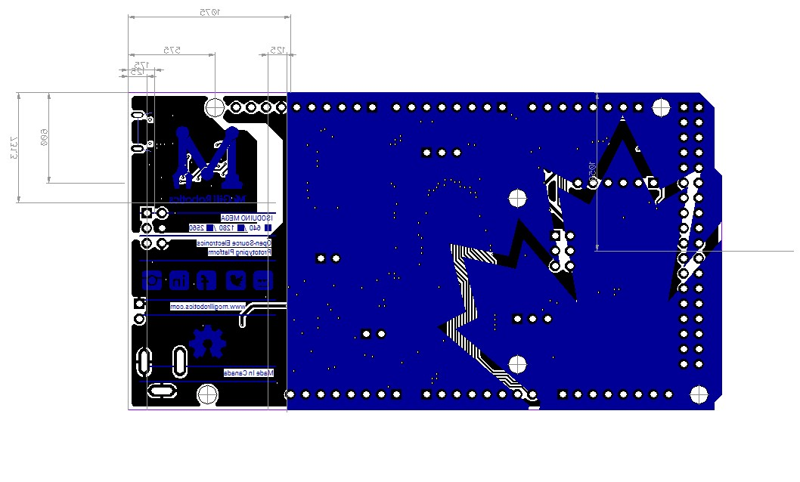

# Isoduino Mega 640/1280/2560

__Author:__ Bei Chen Liu

__Description:__ An isolated Arduino Compatible development board specially designed for robotics operation.

__Features:__
* Isolated UART to protect computer from motor noise.
* Switching regulator to allow bigger range of voltage input.

## Changelog:

### Version 1.4
- Add the ability to sense input voltage level using A0 and/or A8
- Add the ability to sense if USB power is available
- Add the ability to sense power mux state
- Add the ability to force mux auto-select 5V source or force mux to use buck 5V 
- Fix reboot on bypass power loss by changing the TPS2115A to TPS2113A
- Change the isolation IC to a more common form factor
- Reduce size of some resistors, capacitors and LEDs
- Change the size of and value PTC fuse
- Change the USB connector from mini to micro
- Swap label for user LEDs (LED0 and LED1)
- Reroute most of the board to fit the changes

### Version 1.3B
- Removed oscillator resistor
- Better routing for the reset line
- Reduce the board size by a little to make fit in 10cm

### Version 1.3
- Change the non isolated mode name from 'USB Mode' to 'Bypass Mode'
- Added a power mux to handle power switching from isolated mode to bypass mode
- Added power LED for mode indication
- Change user LED behavior: LED will turn on if the pin is high
- Update components and front silk
- Added back silkscreen

## 3D Rander:

## Schematic:
 
 

## Layout:
 

